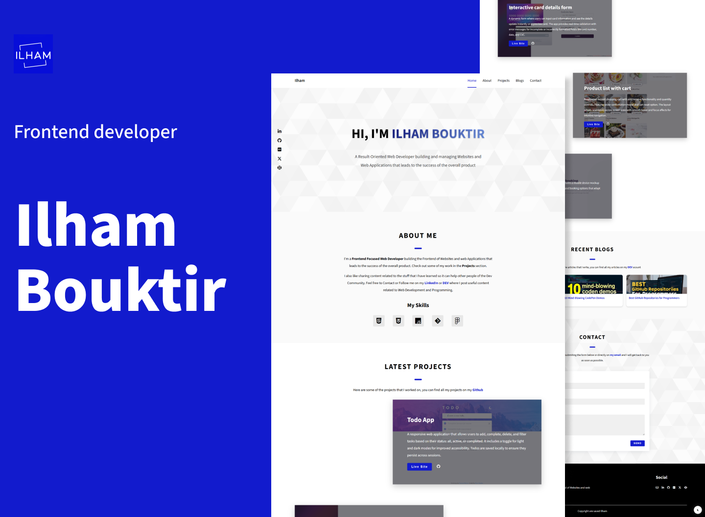

# Personal Portfolio Website

## Table of contents

- [Overview](#overview)
  - [Screenshot](#screenshot)
  - [Links](#links)
- [My process](#my-process)
  - [Built with](#built-with)
  - [Features](#features)
  - [What I learned](#what-i-learned)
  - [Useful resources](#useful-resources)
  - [Contact](#contact)
- 

## Overview

### Screenshot

### Links

- Live Site URL: [Live site](https://ilham-bouk.github.io/Personal_Portfolio/)

## My process

### Built with

- Semantic HTML5 markup
- CSS custom properties
- Flexbox
- CSS Grid
- JavaScript
- Desktop-first workflow

### Features

- Responsive design

### What I learned

### Useful resources

## Contact

- Email: ilhambouktir8@gmail.com
- LinkedIn: [Ilham Bouktir](https://www.linkedin.com/in/ilham-bouktir-0b266b31b)
- GitHub: https://github.com/ilham-bouk
