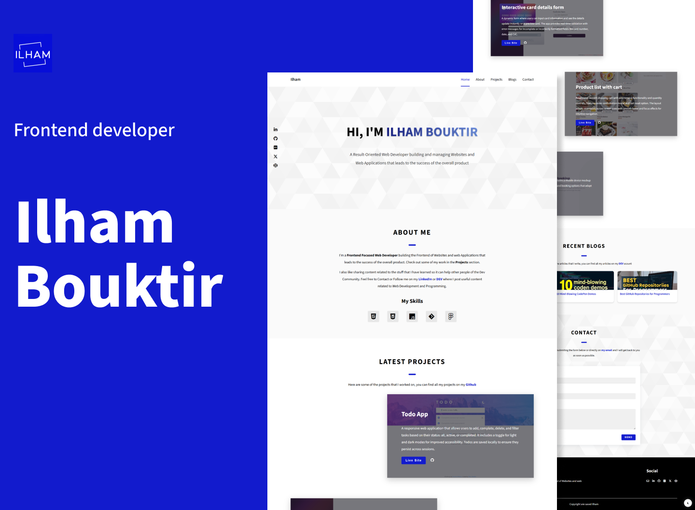

# Ilham Bouktir - Personal Portfolio

A clean, responsive personal portfolio website showcasing my front-end development projects and skills.

## Table of contents

- [Overview](#overview)
  - [Screenshot](#screenshot)
  - [Links](#links)
- [My process](#my-process)
  - [Built with](#built-with)
  - [Features](#features)
  - [What I learned](#what-i-learned)
  - [Useful resources](#useful-resources)
  - [Contact](#contact)

## Overview

### Preview

### Live Site

- Live Site URL: [Visit Portfolio](https://ilham-bouk.github.io/Personal_Portfolio/)

## About

This portfolio website serves as a professional showcase of my work as a front-end developer. It features a modern design with smooth animations and full responsiveness across all devices.

### Features

- Fully responsive design (mobile, tablet, desktop)
- Fast loading and optimized performance
- Clean and modern UI/UX
- Project showcase with live demos and GitHub links
- Recent blogs with links
- Contact form integration and social links
- Dark/Light mode toggle

## My process

### Built with

**HTML5**:
  - Semantic markup
**CSS3**:
  - Modern styling with Flexbox/Grid
  - CSS custom properties
**JavaScript**:
 - Interactive features
 -
**Desktop-first workflow**

### What I learned

### Useful resources

## Contact

- Email: ilhambouktir8@gmail.com
- LinkedIn: [Ilham Bouktir](https://www.linkedin.com/in/ilham-bouktir-0b266b31b)
- GitHub: https://github.com/ilham-bouk
